# Documentation Systems at Scale

I build documentation systems for teams shipping at startup speed and enterprise scale.

When thousands of pull requests move through a product organization, documentation cannot depend on memory, manual tracking, or someone noticing the right change at the right time. I design workflows that detect documentation impact, route context to the right people, and make docs part of the engineering system itself.

I also treat documentation as product data for humans and agents. Good docs do not only live on a website: they feed coding agents, MCP workflows, answer engines, and product experiences that help users understand, trust, and activate features at the moment they need them.

My work sits between technical writing, docs-as-code, automation, AI-assisted analysis, developer experience tooling, and agent-ready content systems.

The goal is simple: make documentation scale with the product, and make product knowledge usable by both people and machines.

## Documentation Operating System

```mermaid
flowchart LR
    classDef input fill:#eef6ff,stroke:#2563eb,stroke-width:1px,color:#0f172a;
    classDef signal fill:#f4f0ff,stroke:#7c3aed,stroke-width:1px,color:#1f1235;
    classDef ops fill:#ecfdf3,stroke:#16a34a,stroke-width:1px,color:#102314;
    classDef delivery fill:#fff7ed,stroke:#f97316,stroke-width:1px,color:#2c1603;
    classDef agent fill:#fef2f2,stroke:#dc2626,stroke-width:1px,color:#2b0b0b;

    subgraph engineering["Engineering Motion"]
        prs["Thousands of PRs"]
        changes["Code, API, and UX changes"]
        releases["Release pressure"]
    end

    subgraph signalLayer["Signal Layer"]
        detect["Doc impact detection"]
        priority["Relevance and priority"]
        context["Structured context"]
    end

    subgraph operations["Docs Operations"]
        triage["Chat-native triage"]
        owners["Route to owners"]
        dashboards["Operational dashboards"]
    end

    subgraph deliveryLayer["Documentation Delivery"]
        update["Docs-as-code updates"]
        review["Structured review"]
        publish["Release-aligned docs"]
    end

    subgraph activation["Agent and User Activation"]
        mcp["MCP-ready context"]
        agents["Coding-agent workflows"]
        answers["Answer and generative discovery"]
        users["User activation loops"]
    end

    prs --> detect
    changes --> detect
    releases --> priority
    detect --> priority --> context --> triage --> owners --> update --> review --> publish
    context --> dashboards
    dashboards --> triage
    publish --> mcp --> agents --> users
    publish --> answers --> users
    users -. feedback loop .-> detect

    class prs,changes,releases input;
    class detect,priority,context signal;
    class triage,owners,dashboards ops;
    class update,review,publish delivery;
    class mcp,agents,answers,users agent;
```

## Current Focus

- PR impact detection for documentation
- Docs-as-code workflows
- Review and triage automation
- Documentation operations dashboards
- MCP-ready and agent-readable content systems
- Answer Engine Optimization (AEO) and Generative Engine Optimization (GEO)
- Structured content for developer experience and user activation
