# Documentation Systems at Scale

I build documentation systems for teams shipping at startup speed and enterprise scale.

When thousands of pull requests move through a product organization, documentation cannot depend on memory, manual tracking, or someone noticing the right change at the right time. I design workflows that detect documentation impact, route context to the right people, and make docs part of the engineering system itself.

My work sits between technical writing, docs-as-code, automation, AI-assisted analysis, and developer experience tooling.

The goal is simple: make documentation scale with the product, not trail behind it.

## Documentation Operating System

```mermaid
flowchart LR
    classDef input fill:#eef6ff,stroke:#2563eb,stroke-width:1px,color:#0f172a;
    classDef signal fill:#f4f0ff,stroke:#7c3aed,stroke-width:1px,color:#1f1235;
    classDef ops fill:#ecfdf3,stroke:#16a34a,stroke-width:1px,color:#102314;
    classDef delivery fill:#fff7ed,stroke:#f97316,stroke-width:1px,color:#2c1603;

    subgraph engineering["Engineering Motion"]
        prs["Thousands of PRs"]
        changes["Code, API, and UX changes"]
        releases["Release pressure"]
    end

    subgraph signalLayer["Signal Layer"]
        detect["Doc impact detection"]
        priority["Relevance and priority"]
        context["Context enrichment"]
    end

    subgraph operations["Docs Operations"]
        triage["Chat-native triage"]
        owners["Route to owners"]
        dashboards["Operational dashboards"]
    end

    subgraph deliveryLayer["Documentation Delivery"]
        update["Docs-as-code updates"]
        review["Structured review"]
        publish["Release-aligned docs"]
    end

    prs --> detect
    changes --> detect
    releases --> priority
    detect --> priority --> context --> triage --> owners --> update --> review --> publish
    context --> dashboards
    dashboards --> triage
    publish -. feedback loop .-> detect

    class prs,changes,releases input;
    class detect,priority,context signal;
    class triage,owners,dashboards ops;
    class update,review,publish delivery;
```

## Current Focus

- PR impact detection for documentation
- Docs-as-code workflows
- Review and triage automation
- Documentation operations dashboards
- Structured content and developer experience tooling
